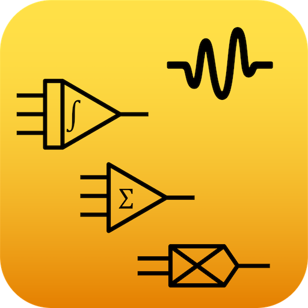
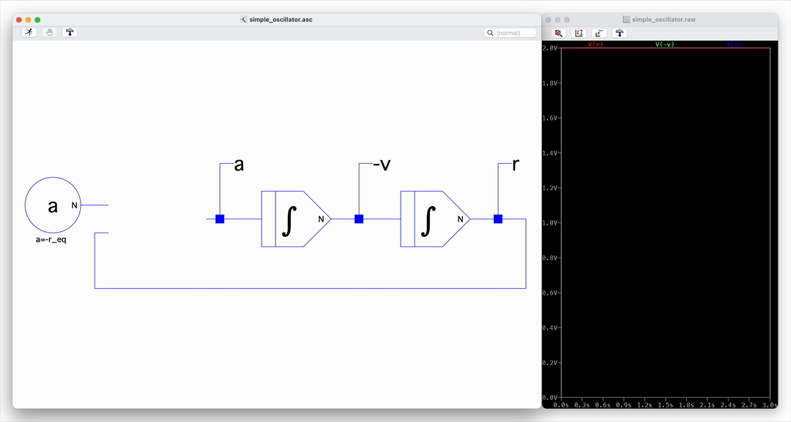
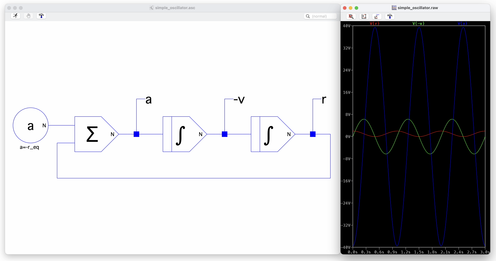

<p align="center">
    
    <br>
    <h1 align="center">
        Analog Computing Elements for LTspice
    </h1>
    <h3 align="center">
        A library of the archetypal analog computing elements, implemented in LTspice.
    </h3>
    <p></p>
    <p align="center">
    <a href="#about">About</a> •
    <a href="#getting-started">Getting Started</a> •
    <a href="#usage">Usage</a> •
    <a href="#troubleshooting">Troubleshooting</a>
    </p>
    <p></p>
</p>

<br>

<picture>
    <source media="(prefers-color-scheme: dark)" srcset=".assets/img/computing_element_symbols/all_elements_white.svg">
    <source media="(prefers-color-scheme: light)" srcset=".assets/img/computing_element_symbols/all_elements_black.svg">
    
</picture>


<br>

# About

Analog computing uses continuous physical quantities to solve mathematical problems through circuit topologies rather than digital algorithms. Where digital computers discretise problems into sequential operations, analog computers represent variables as voltages and perform operations using the inherent physics of electronic components. This library provides a complete set of LTspice-compatible computing elements that abstract the complexity of analog circuit design, allowing you to rapidly prototype and simulate analog computing systems at multiple levels of fidelity.

Rather than manually drawing out individual op-amp circuits and updating component values across your schematics, this library lets you work with high-level computing abstractions - such as integrators, multipliers, and summers - that can be parameterised using SPICE directives. This approach becomes particularly powerful when combined with hierarchical design and global parameterisation, enabling you to build complex modular systems where parameter changes propagate automatically throughout your design. The library also integrates seamlessly with LTspice's batch simulation modes and scripting interfaces such as PyLTSpice, making it straightforward to run systematic parameter sweeps and repeatable experiments.

### Computing Elements

The following table outlines the analog computing elements and their ideal transfer functions.

<table>
    <tr>
        <td width="100" align="center" valign="center"><b>Name</b></td>
        <td width="150" align="center" valign="center"><b>Symbol</b></td>
        <td width="300" align="center" valign="center"><b>Transfer Function</b></td>
    </tr>
    <tr>
        <td align="center" valign="center">Coefficient</td>
        <td align="center" valign="center">
            <picture>
                <source media="(prefers-color-scheme: dark)" srcset=".assets/img/computing_element_symbols/coefficient_white.svg" height="50">
                <source media="(prefers-color-scheme: light)" srcset=".assets/img/computing_element_symbols/coefficient_black.svg" height="50">
                
            </picture>
        </td>
        <!-- <td>$ f(x) = a $</td> -->
        <td align="left" valign="center">
            &nbsp; &nbsp; &nbsp;
            <picture>
                <source media="(prefers-color-scheme: dark)" srcset=".assets/img/computing_element_functions/coefficient_white.svg">
                <source media="(prefers-color-scheme: light)" srcset=".assets/img/computing_element_functions/coefficient_black.svg">
                
            </picture>
        </td>
    </tr>
    <tr>
        <td align="center" valign="center">Buffer</td>
        <td align="center" valign="center">
            <picture>
                <source media="(prefers-color-scheme: dark)" srcset=".assets/img/computing_element_symbols/buffer_white.svg" height="50">
                <source media="(prefers-color-scheme: light)" srcset=".assets/img/computing_element_symbols/buffer_black.svg" height="50">
                
            </picture>
        </td>
        <!-- <td>$ f(x) = x $</td> -->
        <td align="left" valign="center">
            &nbsp; &nbsp; &nbsp;
            <picture>
                <source media="(prefers-color-scheme: dark)" srcset=".assets/img/computing_element_functions/buffer_white.svg">
                <source media="(prefers-color-scheme: light)" srcset=".assets/img/computing_element_functions/buffer_black.svg">
                
            </picture>
        </td>
    </tr>
    <tr>
        <td align="center" valign="center">Inverter</td>
        <td align="center" valign="center">
            <picture>
                <source media="(prefers-color-scheme: dark)" srcset=".assets/img/computing_element_symbols/inverter_white.svg" height="50">
                <source media="(prefers-color-scheme: light)" srcset=".assets/img/computing_element_symbols/inverter_black.svg" height="50">
                
            </picture>
        </td>
        <!-- <td>$ f(x) = -\frac{a}{b} \cdot x $</td> -->
        <td align="left" valign="center">
            &nbsp; &nbsp; &nbsp;
            <picture>
                <source media="(prefers-color-scheme: dark)" srcset=".assets/img/computing_element_functions/inverter_white.svg">
                <source media="(prefers-color-scheme: light)" srcset=".assets/img/computing_element_functions/inverter_black.svg">
                
            </picture>
        </td>
    </tr>
    <tr>
        <td align="center" valign="center">Summer</td>
        <td align="center" valign="center">
            <picture>
                <source media="(prefers-color-scheme: dark)" srcset=".assets/img/computing_element_symbols/summer_white.svg" height="50">
                <source media="(prefers-color-scheme: light)" srcset=".assets/img/computing_element_symbols/summer_black.svg" height="50">
                
            </picture>
        </td>
        <!-- <td>$ f(x_0, x_1) = -a \cdot \left(\frac{x_0}{b_0} + \frac{x_1}{b_1}\right) $</td> -->
        <td align="left" valign="center">
            &nbsp; &nbsp; &nbsp;
            <picture>
                <source media="(prefers-color-scheme: dark)" srcset=".assets/img/computing_element_functions/summer_white.svg">
                <source media="(prefers-color-scheme: light)" srcset=".assets/img/computing_element_functions/summer_black.svg">
                
            </picture>
        </td>
    </tr>
    <tr>
        <td align="center" valign="center">Logarithm</td>
        <td align="center" valign="center">
            <picture>
                <source media="(prefers-color-scheme: dark)" srcset=".assets/img/computing_element_symbols/log_white.svg" height="50">
                <source media="(prefers-color-scheme: light)" srcset=".assets/img/computing_element_symbols/log_black.svg" height="50">
                
            </picture>
        </td>
        <!-- <td>$ f(x) = -5 \cdot \ln(x) $</td> -->
        <td align="left" valign="center">
            &nbsp; &nbsp; &nbsp;
            <picture>
                <source media="(prefers-color-scheme: dark)" srcset=".assets/img/computing_element_functions/log_white.svg">
                <source media="(prefers-color-scheme: light)" srcset=".assets/img/computing_element_functions/log_black.svg">
                
            </picture>
        </td>
    </tr>
    <tr>
        <td align="center" valign="center">Exponential</td>
        <td align="center" valign="center">
            <picture>
                <source media="(prefers-color-scheme: dark)" srcset=".assets/img/computing_element_symbols/antilog_white.svg" height="50">
                <source media="(prefers-color-scheme: light)" srcset=".assets/img/computing_element_symbols/antilog_black.svg" height="50">
                
            </picture>
        </td>
        <!-- <td>$ f(x) = -\exp\left(\frac{x}{5}\right) $</td> -->
        <td align="left" valign="center">
            &nbsp; &nbsp; &nbsp;
            <picture>
                <source media="(prefers-color-scheme: dark)" srcset=".assets/img/computing_element_functions/antilog_white.svg">
                <source media="(prefers-color-scheme: light)" srcset=".assets/img/computing_element_functions/antilog_black.svg">
                
            </picture>
        </td>
    </tr>
    <tr>
        <td align="center" valign="center">Integrator</td>
        <td align="center" valign="center">
            <picture>
                <source media="(prefers-color-scheme: dark)" srcset=".assets/img/computing_element_symbols/integrator_white.svg" height="50">
                <source media="(prefers-color-scheme: light)" srcset=".assets/img/computing_element_symbols/integrator_black.svg" height="50">
                
            </picture>
        </td>
        <!-- <td>$ f(x) = -\frac{1}{\tau} \cdot \int x \, dt + \text{ic} $</td> -->
        <td align="left" valign="center">
            &nbsp; &nbsp; &nbsp;
            <picture>
                <source media="(prefers-color-scheme: dark)" srcset=".assets/img/computing_element_functions/integrator_white.svg">
                <source media="(prefers-color-scheme: light)" srcset=".assets/img/computing_element_functions/integrator_black.svg">
                
            </picture>
        </td>
    </tr>
    <tr>
        <td align="center" valign="center">Differentiator</td>
        <td align="center" valign="center">
            <picture>
                <source media="(prefers-color-scheme: dark)" srcset=".assets/img/computing_element_symbols/differentiator_white.svg" height="50">
                <source media="(prefers-color-scheme: light)" srcset=".assets/img/computing_element_symbols/differentiator_black.svg" height="50">
                
            </picture>
        </td>
        <!-- <td>$ f(x) = -\tau \cdot \frac{dx}{dt} $</td> -->
        <td align="left" valign="center">
            &nbsp; &nbsp; &nbsp;
            <picture>
                <source media="(prefers-color-scheme: dark)" srcset=".assets/img/computing_element_functions/differentiator_white.svg">
                <source media="(prefers-color-scheme: light)" srcset=".assets/img/computing_element_functions/differentiator_black.svg">
                
            </picture>
        </td>
    </tr>
    <tr>
        <td align="center" valign="center">Multiplier</td>
        <td align="center" valign="center">
            <picture>
                <source media="(prefers-color-scheme: dark)" srcset=".assets/img/computing_element_symbols/multiplier_white.svg" height="50">
                <source media="(prefers-color-scheme: light)" srcset=".assets/img/computing_element_symbols/multiplier_black.svg" height="50">
                
            </picture>
        </td>
        <!-- <td>$ f(x_0, x_1) = \frac{1}{10} \cdot x_0 \cdot x_1 $</td> -->
        <td align="left" valign="center">
            &nbsp; &nbsp; &nbsp;
            <picture>
                <source media="(prefers-color-scheme: dark)" srcset=".assets/img/computing_element_functions/multiplier_white.svg">
                <source media="(prefers-color-scheme: light)" srcset=".assets/img/computing_element_functions/multiplier_black.svg">
                
            </picture>
        </td>
    </tr>
    <tr>
        <td align="center" valign="center">Divider</td>
        <td align="center" valign="center">
            <picture>
                <source media="(prefers-color-scheme: dark)" srcset=".assets/img/computing_element_symbols/divider_white.svg" height="50">
                <source media="(prefers-color-scheme: light)" srcset=".assets/img/computing_element_symbols/divider_black.svg" height="50">
                
            </picture>
        </td>
        <!-- <td>$ f(x_0, x_1) = -10 \cdot \frac{x_0}{x_1} $</td> -->
        <td align="left" valign="center">
            &nbsp; &nbsp; &nbsp;
            <picture>
                <source media="(prefers-color-scheme: dark)" srcset=".assets/img/computing_element_functions/divider_white.svg">
                <source media="(prefers-color-scheme: light)" srcset=".assets/img/computing_element_functions/divider_black.svg">
                
            </picture>
        </td>
    </tr>
    <tr>
        <td align="center" valign="center">Square Root</td>
        <td align="center" valign="center">
            <picture>
                <source media="(prefers-color-scheme: dark)" srcset=".assets/img/computing_element_symbols/sqrt_white.svg" height="50">
                <source media="(prefers-color-scheme: light)" srcset=".assets/img/computing_element_symbols/sqrt_black.svg" height="50">
                
            </picture>
        </td>
        <!-- <td>$ f(x) = \sqrt{-10 \cdot \frac{a}{b} \cdot x} $</td> -->
        <td align="left" valign="center">
            &nbsp; &nbsp; &nbsp;
            <picture>
                <source media="(prefers-color-scheme: dark)" srcset=".assets/img/computing_element_functions/sqrt_white.svg">
                <source media="(prefers-color-scheme: light)" srcset=".assets/img/computing_element_functions/sqrt_black.svg">
                
            </picture>
        </td>
    </tr>
</table>


## Simulation Types

Each computing element is available in three different implementations, allowing you to choose the appropriate level of abstraction for your design stage:

### Numerical Simulation
The numerical implementation provides pure behavioural models using arbitrary voltage sources and mathematical expressions. These elements simulate the ideal transfer functions with perfect accuracy, unbounded by physical limitations. Use numerical simulation when you need to validate the mathematical correctness of your system topology, explore parameter spaces quickly, or verify that your computing architecture solves the intended problem before worrying about circuit-level details.

### Ideal-Component Simulation
The ideal-component implementation uses the archetypal electronic schematics for each computing element (typically op-amp-based circuits) but with idealised SPICE models - high gain, high bandwidth, zero offset, and so on. This bridges the gap between pure mathematics and physical realisation, letting you verify that your design maps correctly onto standard analog computing circuit topologies while still avoiding the complications of real-world component behaviour. It's particularly useful for catching architectural issues that emerge from the circuit structure itself rather than component limitations.

### Real-Component Simulation
The real-component implementation uses actual SPICE models for specific integrated circuits - by default: the TL071 op-amp and AD633 analog multiplier. These simulations incorporate real-world idiosyncrasies: finite bandwidth, slew rate limitations, input bias currents, offset voltages, and non-linearities. Use real-component simulation when you need to assess how your design will perform with actual hardware, identify potential stability issues, or determine whether component specifications are adequate for your application. This is the final validation step before building physical circuits.

## Features

- **Complete element library** - All archetypal analog computing elements: summers, integrators, multipliers, dividers, log/antilog, differentiators, and more
- **Three simulation levels** - Numerical, ideal-component, and real-component implementations let you choose the right abstraction for your design stage
- **Parameterised design** - All elements accept SPICE parameters, enabling global parameterisation and systematic parameter sweeps across complex hierarchical designs
- **Modular and hierarchical** - Build reusable computing modules with automatic parameter propagation throughout your system
- **Automation-ready** - Integrates with LTspice batch modes and scripting interfaces like PyLTSpice for repeatable experiments
- **Cross-platform** - Works on any operating system that runs LTspice
- **Plug-and-play** - Simply copy the files to your project directory and start building circuits immediately

<br>

# Getting Started

## Prerequisites

The only requirement is a working installation of LTspice. The library should work on any operating system.

## Quick Start

1. Clone or download the repository
2. Run the `make.py` script
3. Copy the contents of the `all` directory to an LTspice project directory
4. Open a new or existing LTspice schematic
5. Open the LTspice component-picker dialog (F2)
6. Select the project directory as the top directory
7. Pick one of the computing elements and place it in the circuit
8. Connect the computing elements as you would any other LTspice component

<p></p>
<p align="center">
    
    <br>
    Adding a summer element to complete an analog circuit for a simple one-dimensional oscillator.
</p>

## Installation

### Basic Usage (Per-Project Installation)

The simplest way to use this library is to copy the required files into your LTspice project directory. Once the schematic and symbol files are in the same directory as your project, they'll appear automatically in the component-picker dialog (F2).

Since many computing elements depend on other elements or SPICE models, the most reliable approach is to copy all files at once. The included `make.py` script automates this process:

1. Clone or download this repository
2. Run the make script: `./make.py` or `python3 make.py`
3. Copy the contents of the newly populated `all` directory into your LTspice project directory

The make script handles all dependencies and renames elements to prevent conflicts by appending their simulation type (e.g., `integrator_numerical.asy`, `integrator_ideal.asy`, `integrator_real.asy`). Once copied, you can place any computing element directly from the component-picker without worrying about missing dependencies.

### Global Installation (Windows Only)

For system-wide access to the library across all projects, you can configure LTspice's global search paths:

1. Copy the `computing_elements` directory to a permanent location on your system
2. Open LTspice and navigate to: `Tools` → `Control Panel` → `Sym. & Lib. Search Paths`
3. Add entries for both the root `computing_elements` directory and each of its subdirectories

After configuring these paths, the computing elements will appear in the component-picker's directory dropdown regardless of your current working directory.

**Limitations:**
- This method is not available on macOS, where the Control Panel lacks the search paths configuration pane
- Even on Windows, LTspice's handling of nested directories can be inconsistent. Unlike the built-in component libraries, it may not properly traverse subdirectories, so you'll need to add each subdirectory explicitly

<br>

# Usage

## Building Circuits

Create analog computing circuits by placing and wiring elements together as you would with any other LTspice component. The computing elements integrate seamlessly into LTspice's standard workflow - simply select them from the component-picker (F2) and connect their inputs and outputs using the standard wire tool.

## Parameterising Elements

Most computing elements accept parameters that control their behaviour. To configure an element:

1. Right-click the component in your schematic
2. Enter parameters in the `PARAMS` field using the format: `param_name=param_value`
3. Separate multiple parameters with spaces

**Example:** An integrator with a time constant of 10 seconds and initial condition of 2.5 volts:
```
timescale=10.0 ic=2.5
```

Common parameters include:
- Integrators: `timescale` (τ), `ic` (initial condition)
- Inverters, coefficients, and summers: `a` and `b` (gain ratios)
- Divider and square root: `a` and `b` (scaling factors)

## Running Simulations

Whilst any SPICE simulation type can be used, transient analysis is typically most relevant for analog computing systems. Transient simulations show how voltages evolve over time, which is essential when working with dynamic systems that include integrators or differentiators.

Run a transient simulation by adding a `.tran` SPICE directive to your schematic:

```
.tran stop_time [start_time] [maximum_timestep]
```

**Example:** Simulate for 10 seconds with a maximum timestep of 1ms:
```
.tran 0 10 0 0.001
```

See the [Troubleshooting](#troubleshooting) section if you encounter convergence issues or simulation performance problems.

## Examples

The `examples` directory contains demonstration circuits that show how to use the computing elements:

### Testbench (testbench_all_elements)

A comprehensive test schematic that instantiates all computing elements across all three simulation types (numerical, ideal, real). Each element receives the same input signal, allowing direct comparison of their behaviour. Running a transient simulation on this schematic lets you empirically assess the behaviour of each computing element to ensure they're working as expected.

#### This testbench is particularly useful for:
- Verifying correct installation of the library
- Understanding the characteristics and limitations of each element type
- Validating changes or modifications to the library
- Comparing numerical, ideal, and real implementations side-by-side

For more thorough analysis, this simulation can be run through a Python interface such as PyLTSpice, allowing you to systematically extract and analyse the results programmatically.

### Simple Oscillator (system_simple_oscillator)

A simple one-dimensional harmonic oscillator demonstrating how to construct a complete dynamic system using the computing elements. This example implements a mass-spring system using integrators, summers, and coefficient elements, showcasing parameterised design with values for mass, spring constant, and initial conditions.

#### This example illustrates:
- How to wire together multiple computing elements to solve differential equations
- Parameterisation of a complete system for easy experimentation
- The basic workflow for analog computing circuit design

<p></p>
<p align="center">
    
    <br>
    The simple oscillator circuit topology, implementing the equations of motion for a one-dimensional mass-spring system.
</p>

**Note:** Some examples use utility elements (abs, min, max, switch) from the `utils` subdirectory. These are non-standard operations packaged as computing elements that can be useful for certain implementations. They're included automatically when you run the `make.py` script.


<br>

# Troubleshooting

## "Couldn't find symbol(s)" Error

This error occurs when LTspice cannot locate the schematic or symbol files for the computing elements you're trying to use.

### Solutions:
- Ensure all required model files and dependencies are in the same directory as your project schematic
- Check that both `.asc` (schematic) and `.asy` (symbol) files are present for each element
- For real-component simulations, confirm that the required SPICE model files (`tl071.lib`, `ad633.cir`) are included in your project directory
- If you've installed the library globally (Windows only), verify that the search paths are correctly configured

## Singular Matrix Error

A singular matrix error indicates that SPICE has encountered an unsolvable system of equations, typically caused by short-circuits, zero-impedance connections, or improper grounding.

### Debugging Steps:

1. **Verify connectivity** - Double-check that all inputs and outputs are correctly connected and that ground nodes are properly placed. Floating nodes or accidental short-circuits are common culprits.

2. **Step backwards through simulation types** - Start with numerical simulation to verify your mathematical topology. Then progress to ideal-component, and finally real-component simulation. This helps identify which level of realisation introduces the problem.

3. **Isolate problematic elements** - Systematically swap individual elements between simulation types to identify which specific component or region is causing the problem. *Hint: editing the schematic file in a text editor and using find-and-replace to change element names (e.g., `integrator_real` to `integrator_ideal`) is much faster than manually replacing components in the GUI.*

4. **Add small resistances** - Insert small resistors (e.g., 1Ω to 10Ω) between elements or at outputs. This can break problematic zero-impedance loops whilst having negligible effect on circuit behaviour.

5. **Adjust SPICE shunt parameters** - Try adding RSHUNT and/or CSHUNT parameters to the SPICE settings. These connect all nodes to ground through a very high resistance or very small capacitance, which can aid convergence. Add `.options RSHUNT=1e12` or `.options CSHUNT=1e-15` as a SPICE directive, and vary the values by several orders of magnitude to ensure they're helping convergence without affecting the overall circuit behaviour.

6. **Check for parameter-induced extremes** - See the next section, as parameter issues can also manifest as singular matrix errors.

## Slow Simulation / Timestep Errors / Incomplete Simulation

These issues typically arise from excessive stiffness in the equations, extreme component values, or inappropriate solver settings.

### Solutions:

1. **Review parameter values** - Ensure your parameters aren't producing extremely large or small resistances or capacitances (e.g., values exceeding $10^{\pm12}$). Such values force the solver to use tiny timesteps, dramatically slowing simulation or causing failure. Common culprits:
    - Integrator time constants (τ) that are too small or too large
    - Coefficient gains that amplify signals to unrealistic values
    - Divider inputs that produce very large outputs

2. **Verify initial conditions** - Incorrect initial conditions can cause transients that prevent convergence. Make sure integrators have appropriate initial condition values specified, particularly if your system has multiple stable states.

3. **Adjust the UIC directive** - The `UIC` (Use Initial Conditions) flag in the `.tran` command tells LTspice whether to use the specified initial conditions directly or to compute an operating point first:
    - Include `UIC` if you have well-defined initial conditions: `.tran 0 10 0 UIC`
    - Omit `UIC` to let SPICE compute the DC operating point first: `.tran 0 10`
    - Experiment with both options to see which works better for your specific circuit
    - All-numerical schematics often exhibit to unexpected behaviour when the UIC flag is used

4. **Modify solver settings** - Access SPICE settings by going to `Tools` → `Control Panel` → `SPICE`. Adjust:
    - Integration method (e.g., switch between Gear and trapezoidal)
    - Relative tolerance (reltol) - decreasing this improves accuracy but slows simulation
    - Absolute tolerances (abstol, vntol, etc.) - increasing these can help convergence for stiff systems
    - Maximum timestep - explicitly limit timestep size with a maximum value in the `.tran` command: `.tran 0 10 0 0.001` (fourth argument)

5. **Simplify during debugging** - If a complex multi-element system is failing, temporarily reduce the simulation time, decrease the number of active elements, or substitute simpler numerical elements to isolate the problematic section of your circuit.

<br>

# Status

This project is not undergoing active development. I might update the repo if I decide to add anything else, such as a function generator, but I don't have any plans to.

<br>

# Contact

If you want to ask me about this repo, please [send me an email](william.rochira@hotmail.co.uk).

<br>

# Related Projects

This repo is a dependency of several of my other LTspice analog computing repos.

<!-- TODO: add links to these repos. -->

<br>

# License

This project is licensed under the [CC BY-NC-SA 4.0 License](https://creativecommons.org/licenses/by-nc-sa/4.0/). You can freely use, modify, and share this work for non-commercial purposes. You must give appropriate credit. Any modifications must be shared under the same licence. You cannot use this work for commercial purposes without permission.

[](https://creativecommons.org/licenses/by-nc-sa/4.0/)

<br>

# References

[1] Analog Devices, *LTspice*. Available: https://www.analog.com/en/resources/design-tools-and-calculators/ltspice-simulator.html

[2] N. Brum, *PyLTSpice*: A set of tools to Automate LTSpice simulations. Available: https://github.com/nunobrum/PyLTSpice

---

&nbsp;&middot;&nbsp;
GitHub [@wrochira](https://github.com/wrochira)
&nbsp;&middot;&nbsp;
Email [william.rochira@hotmail.co.uk](william.rochira@hotmail.co.uk)
&nbsp;&middot;&nbsp;
Website [wrochira.github.io](https://www.wrochira.github.io)
&nbsp;&middot;&nbsp;


<!-- TODO
- Computing elements rundown including descriptions, images, quirks, and caveats (e.g. log amplifier scaling)
- Explain the unusual elements: summer_SJ and integrator_true elements
- Add more images and descriptions of example circuits
-->
